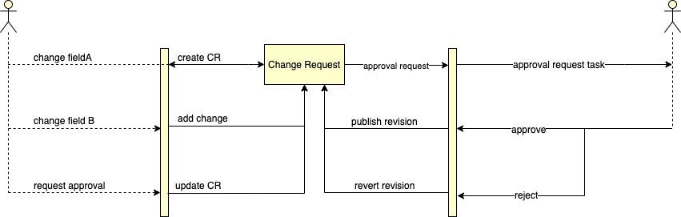

title: Revisions
created at: Fri Nov 08 2019 16:39:37 GMT+0000 (Coordinated Universal Time)
updated at: Sat Dec 12 2020 00:26:16 GMT+0000 (Coordinated Universal Time)
---

# Revisions



## **Generic revision system**

We created a generic revision system, that can keep track of changes on every existing model.

**Revision Schema:**

```json
{
  "id": "string",
  "type": "enum", → (Component, Project, ProjectTemplate,...)
  "typeId": "string",
  "values": "object",
  "version": "number",
  "status": "enum", → (draft, published, deleted),
  "userId": "string",
  "source": "enum", → (user, external, init),
  "publishedDate": "date",
}
```

For example, if we want to create a revision of a projectTemplate, we can do that by doing:

    Revision.create({
      type: 'projectTemplate',
      typeId: req.data.params.id, // get projectTemplate id from params
      values: req.data.body, // get projectTemplate JSON from body
      version: prevVersion + 1,
      status: 'draft',
      userId: req.user.sub,
      source: 'user',
      publishedDate: new Date(),
    });

## **Hooks**

On the revision model, we use the `@BeforeUpdate` and `@BeforeCreate` hooks to process the values of the revision instance.

The primary and most important function of these hooks is to check for differences between the published version and your new version. We fetch the existing instance based on the type and typeId that you pass, and make use of the [jsondiffpatch](https://github.com/benjamine/jsondiffpatch) package to check for differences between the two versions. **Only the difference between the two instances is being saved in the db**. That means that you pass the full JSON of your instance to the values in `Revision.create` , but we overwrite these values with the difference between the two objects.

There are scenario's that you want to publish a revision immediately, or that you just want to publish a revision with only an id. Maybe you want to create a new instance instead of creating a revision of an existing one. To achieve these use-cases, you can pass certain options to these hooks (please note, these are custom options, and can be adjusted or extended in any way we want to):

    Revision.create({
      ...
    }, {
      publishRevisionId: boolean,
      publishRevisionBody: boolean,
      includes: [models],
      externalFieldIds: [fieldIds],
    });

**Publishing a revision is completely handled in the revision helper functions.**

If the typeId property is empty or does not exist, a new instance will be created, based on the type and values that you passed to the revision model.

When fetching a revision, the `@AfterFind` hook is called. This hook will fetch the existing instance and patch your changes.

          